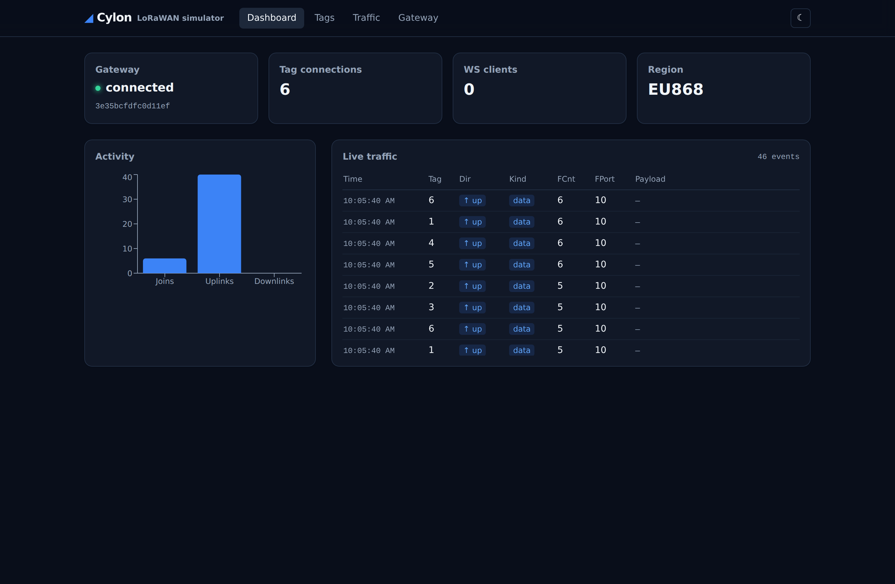
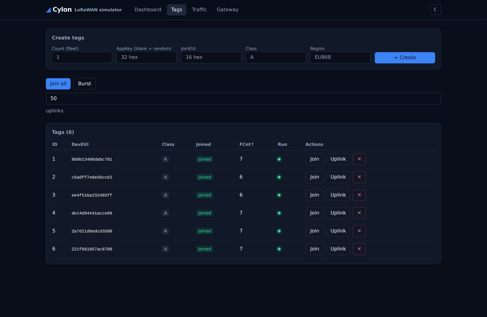
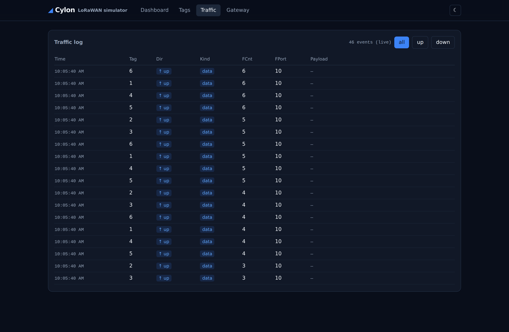
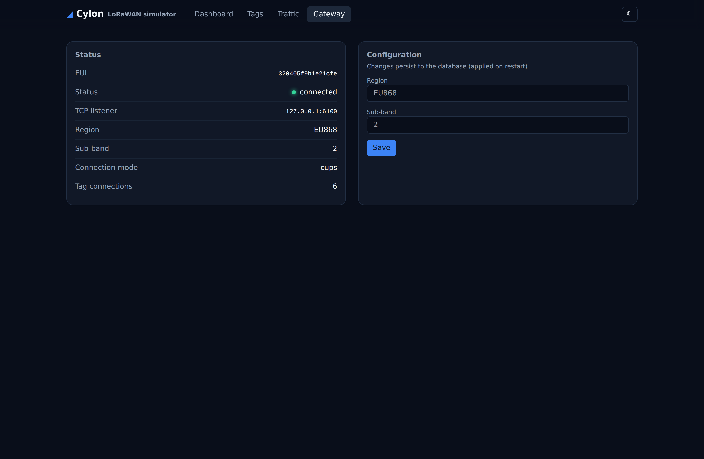
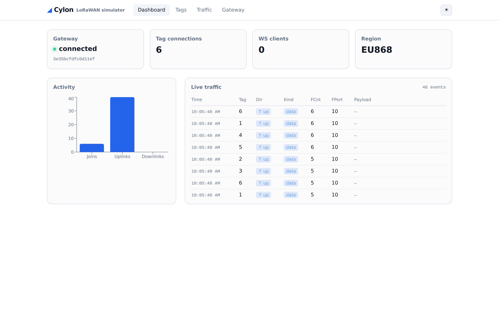

# Cylon

Cylon is a **LoRaWAN simulator** — a web application that fabricates a fleet of
synthetic end-devices ("tags") and a gateway, drives them through a full product
cycle against **AWS IoT Core for LoRaWAN** using the **LoRa Basics Station**
protocol, and is managed through a web UI. No radio hardware: tags talk to the
gateway over TCP, and the gateway forwards to AWS over Basic Station (WebSocket).
All state lives in **SQLite**, and the SPA is embedded into a single Go binary.

> **Status:** active development. Phases 0–3 are in place — the full offline
> join→uplink→downlink cycle is **driveable from the browser** (REST + WebSocket
> + embedded SPA), with a scenario orchestrator, Prometheus metrics, and Class C
> downlinks. Real AWS (CUPS + credentials) and Class B follow.

## Screenshots

### Dashboard — live traffic & gateway status


### Tags — fleet management, join & uplink


### Traffic — live, filterable event log


### Gateway & light theme



## Features

**Phase 0 — scaffolding & persistence**
- Single static binary (`CGO_ENABLED=0`, pure-Go SQLite via `modernc.org/sqlite`).
- SQLite persistence with embedded, versioned migrations (goose).
- Gateway **EUI-64 generated and persisted on first run**, stable across
  restarts, overridable via config/env/flag.
- Bootstrap configuration via YAML + environment overrides.
- Minimal health endpoint and graceful shutdown.

**Phase 1 — tag PHY core**
- OTAA 1.0.3 join (request build, accept parse) with **NwkSKey/AppSKey
  derivation** via `brocaar/lorawan`.
- Data uplink build and downlink decode (FRMPayload decrypt + MAC-command
  surfacing).
- Payload generators: static, counter, random, ramp, sine.
- Per-device session persistence: **monotonic, never-reused DevNonce** and frame
  counters survive restarts.
- Sensitive columns (AppKey, session keys) **encrypted at rest** (AES-256-GCM,
  AAD-bound) via `CYLON_DB_KEY`.

**Phase 2 — gateway, LNS & TCP transport**
- Gateway speaks the **Basic Station LNS protocol** over WebSocket (version →
  router_config handshake, jreq/updf uplinks, dnmsg/dntxed downlinks).
- Tag↔gateway **NDJSON TCP transport** with a conn registry and downlink routing
  (Class A, RX1/RX2 window selection).
- The "bridge invariant": uplinks forward parsed fields with the FRMPayload kept
  encrypted; downlink `pdu` is passed through to the addressed tag.
- **`mock-lns`** offline LNS emulator and a standalone **`tag`** client, enabling
  a full offline join→uplink→downlink cycle with no AWS.

**Phase 3 — web app, orchestrator & Class C**
- **REST API** (`/api`) + **WebSocket live feed** (`/ws`), with the React + Vite +
  Tailwind **SPA embedded** into the binary (`go:embed`).
- **Orchestrator** drives in-process tags over loopback TCP; scenario primitives
  `join_all`, `uplink`, and parallel `burst` (validated with 50 parallel tags).
- **Prometheus metrics** at `/metrics` (uplinks, downlinks, joins, active tags,
  WS clients, …).
- **Class C** unsolicited downlinks pushed from `mock-lns` over the always-open
  RX2 window.
- Traffic persisted to SQLite and streamed live to the browser.

## Quick start

```sh
# Build
go build -o cylon ./cmd/cylon

# Generate a starter config
./cylon gen-config > cylon.yaml

# Run (creates the DB, migrates, generates the gateway EUI, serves /healthz)
CYLON_STORE_PATH=./cylon.db ./cylon serve

# In another shell:
curl -s localhost:8080/healthz
# {"status":"ok","version":"dev","eui":"…"}
```

## CLI

| Command | Description |
|---|---|
| `cylon serve` | Run the web app (HTTP server + database). |
| `cylon migrate [up\|down\|status]` | Run database migrations. |
| `cylon gateway-eui [--set <eui>]` | Show or override the gateway EUI. |
| `cylon gen-config` | Print an example configuration to stdout. |
| `cylon version` | Print the build version. |

Global flag: `-c, --config <path>` selects a YAML config file.

## Configuration

Settings resolve in the order **environment (`CYLON_*`) → config file → built-in
default**. Only bootstrap settings live in config; runtime data (gateway, tags,
sessions) lives in the database.

| Setting | Env | Default | Description |
|---|---|---|---|
| `server.http_listen` | `CYLON_SERVER_HTTP_LISTEN` | `:8080` | UI/API + `/ws` listen address. |
| `server.metrics_listen` | `CYLON_SERVER_METRICS_LISTEN` | `:9100` | Prometheus listen address. |
| `server.log_level` | `CYLON_SERVER_LOG_LEVEL` | `info` | `debug`/`info`/`warning`/`error`. |
| `store.path` | `CYLON_STORE_PATH` | `/var/lib/cylon/cylon.db` | SQLite database file. |
| `gateway.tcp_listen` | `CYLON_GATEWAY_TCP_LISTEN` | `:6000` | Tag TCP listen address. |
| `gateway.lns_url` | `CYLON_GATEWAY_LNS_URL` | _(empty)_ | LNS WebSocket URL. Empty disables the gateway (health only). |
| `gateway.eui` | `CYLON_GATEWAY_EUI` | _(generated)_ | Override the gateway EUI (16 hex). |
| `gateway.eui_prefix` | `CYLON_GATEWAY_EUI_PREFIX` | _(none)_ | Optional EUI prefix; a 3-byte OUI is expanded with `FFFE`. |
| `gateway.connection.creds_dir` | `CYLON_GATEWAY_CONNECTION_CREDS_DIR` | `/etc/cylon/creds` | Basic Station credential volume. |
| `sim.realtime` | `CYLON_SIM_REALTIME` | `true` | Real-time vs. accelerated clock. |

### Secrets at rest

Sensitive columns (AppKey, session keys) are encrypted with AES-256-GCM when
`CYLON_DB_KEY` is set to a 32-byte key (64 hex chars or base64):

```sh
export CYLON_DB_KEY="$(openssl rand -hex 32)"
```

If unset, the binary runs in dev mode and stores these values **unencrypted**
with a loud warning. The API never returns full keys (masked to the last 4).

## Docker

```sh
docker build -t cylon .
docker run --rm -p 8080:8080 \
  -v "$PWD/data:/var/lib/cylon" \
  -v "$PWD/creds:/etc/cylon/creds" \
  cylon
```

## Offline demo (no AWS)

Run the gateway against the bundled `mock-lns` and drive it with the standalone
`tag` client. Use a matching AppKey on the mock and the tag:

```sh
KEY=000102030405060708090a0b0c0d0e0f

# 1. Mock LNS (emulates AWS IoT Core for LoRaWAN)
go run ./cmd/mock-lns --listen 127.0.0.1:7000 --app-key "$KEY"

# 2. Gateway (cylon serve) wired to the mock LNS
CYLON_STORE_PATH=./cylon.db \
CYLON_GATEWAY_LNS_URL=ws://127.0.0.1:7000 \
CYLON_GATEWAY_TCP_LISTEN=127.0.0.1:6000 \
  go run ./cmd/cylon serve

# 3. A tag: join over TCP and send uplinks
go run ./cmd/tag --gateway 127.0.0.1:6000 \
  --dev-eui 0101010101010101 --join-eui 0202020202020202 \
  --app-key "$KEY" --count 3 --interval 2s
```

The tag completes an OTAA join via a downlink routed back through the gateway,
then relays uplinks all the way to the LNS.

Then open **http://localhost:8080** in a browser to drive everything from the
UI: create a fleet of tags, run `join_all` / `burst`, and watch the live traffic
feed. (Create tags with the same AppKey you passed to `mock-lns` so they join.)

## Development

```sh
# Backend tests
go test ./...
go vet ./...

# Build the embedded UI (required before `go build` for a UI-enabled binary)
cd web && npm install && npm run build

# Or run backend + frontend with hot reload (starts mock-lns + cylon + Vite):
./scripts/dev.sh
```

The SPA build writes to `internal/webui/dist`, which is embedded via `go:embed`.
A tracked `.gitkeep` keeps the embed compiling before any build; the production
image and release binaries build the UI first (see the Dockerfile / goreleaser).

## License

Apache-2.0. See [LICENSE](LICENSE).
