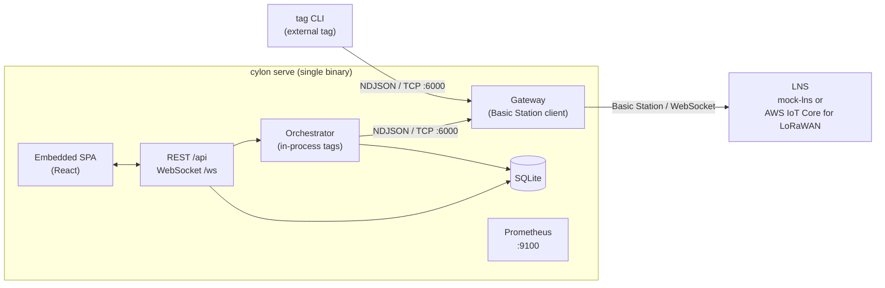

# Cylon

[](https://github.com/t0mer/LoRa-sim/actions/workflows/ci.yml)
[](LICENSE)
[](go.mod)

Cylon is a **LoRaWAN simulator**: a web application that creates a fleet of
synthetic end-devices ("tags") and a gateway, and drives them through OTAA
joins, uplinks, and downlinks against a LoRaWAN Network Server (LNS) that speaks
the **LoRa Basics Station** protocol. The target is **AWS IoT Core for LoRaWAN**.
A bundled `mock-lns` emulates the join side of it, so joins and uplinks also work
offline.

There is no radio hardware. Tags talk to the gateway over TCP, and the gateway
forwards to the LNS over Basic Station (WebSocket). All state lives in
**SQLite**, and the React UI is embedded into a single Go binary. It is aimed at
developers and testers who need realistic LoRaWAN traffic without physical
devices.

> **Status:** active development. Phases 0–3 are merged into `main`: the offline
> join (join-accept downlink) → uplinks cycle is **driveable from the browser**
> (REST + WebSocket + embedded SPA), with a scenario orchestrator, Prometheus
> metrics, and gateway-side Class C downlink routing. Data downlinks need a real
> LNS; `mock-lns` sends only join-accepts. Real AWS connectivity (CUPS + credentials) and
> Class B are **in development on separate branches** and are not available on
> `main` yet. See [Status & roadmap](#status--roadmap).

## Table of contents

- [Screenshots](#screenshots)
- [Features](#features)
- [How it works](#how-it-works)
- [Requirements](#requirements)
- [Installation](#installation)
- [Quick start](#quick-start)
- [Offline demo (no AWS)](#offline-demo-no-aws)
- [CLI reference](#cli-reference)
- [Configuration](#configuration)
- [Web UI](#web-ui)
- [REST API & WebSocket](#rest-api--websocket)
- [Metrics](#metrics)
- [Status & roadmap](#status--roadmap)
- [Security notes](#security-notes)
- [Troubleshooting](#troubleshooting)
- [Development](#development)
- [Contributing](#contributing)
- [License](#license)

## Screenshots

### Dashboard — live traffic & gateway status


### Tags — fleet management, join & uplink


### Traffic — live, filterable event log


### Gateway & light theme


## Features

**Phase 0 — scaffolding & persistence**
- Single static binary (`CGO_ENABLED=0`, pure-Go SQLite via `modernc.org/sqlite`).
- SQLite persistence with embedded, versioned migrations (goose).
- Gateway **EUI-64 generated and persisted on first run**, stable across
  restarts, and overridable via config, env, or the `gateway-eui --set` command
  (see [Gateway EUI precedence](#gateway-eui-precedence)).
- Bootstrap configuration via YAML plus environment overrides.
- Health endpoint (`/healthz`) and graceful shutdown on `SIGINT`/`SIGTERM`.

**Phase 1 — tag PHY core**
- LoRaWAN 1.0.3 OTAA join (request build, accept parse) with **NwkSKey/AppSKey
  derivation** via `brocaar/lorawan`.
- Data uplink build and downlink decode (FRMPayload decrypt + MAC-command
  surfacing).
- Payload generators: `static`, `counter`, `random`, `ramp`, `sine`.
- Per-device session persistence: a **monotonic, never-reused DevNonce** and
  frame counters survive restarts.
- Sensitive columns (AppKey, session keys) **encrypted at rest** (AES-256-GCM,
  AAD-bound) when `CYLON_DB_KEY` is set.

**Phase 2 — gateway, LNS & TCP transport**
- The gateway speaks the **Basic Station LNS protocol** over WebSocket (`version` →
  `router_config` handshake, `jreq`/`updf` uplinks, `dnmsg`/`dntxed` downlinks).
- Tag ↔ gateway **NDJSON-over-TCP transport** with a connection registry and
  downlink routing by DevEUI (Class A, RX1/RX2 window selection).
- The "bridge invariant": uplinks are forwarded as parsed fields with the
  FRMPayload still encrypted; a downlink `pdu` is passed through to the addressed
  tag.
- **`mock-lns`**, an offline LNS emulator, and **`tag`**, a standalone tag client,
  enable an offline join (join-accept downlink) → uplinks cycle with no AWS.
  `mock-lns` never sends data or ACK downlinks; those need a real LNS.

**Phase 3 — web app, orchestrator & Class C**
- **REST API** (`/api`) + **WebSocket live feed** (`/ws`), with the React + Vite +
  Tailwind **SPA embedded** into the binary (`go:embed`).
- **Orchestrator** that drives in-process tags over loopback TCP; scenario
  primitives `join_all` and parallel `burst` (validated with 50 parallel tags),
  plus per-tag join and uplink.
- **Prometheus metrics** on a separate listener (`:9100` by default).
- **Class C** routing: the gateway routes LNS downlinks flagged `dC=2` to the tag
  over the RX2 window. This depends only on the LNS flag; the tag does not
  simulate Class C behavior. The `mock-lns` package can push such downlinks, but
  only the test suite uses that; nothing in the UI, API, or CLI triggers it.
- Traffic persisted to SQLite and streamed live to the browser.

## How it works


```mermaid
flowchart LR
    subgraph cylon["cylon serve (single binary)"]
        UI["Embedded SPA<br/>(React)"]
        API["REST /api<br/>WebSocket /ws"]
        ORCH["Orchestrator<br/>(in-process tags)"]
        GW["Gateway<br/>(Basic Station client)"]
        DB[("SQLite")]
        MET["Prometheus<br/>:9100"]
    end
    EXT["tag CLI<br/>(external tag)"]
    LNS["LNS<br/>mock-lns or<br/>AWS IoT Core for LoRaWAN"]

    UI <--> API
    API --> ORCH
    ORCH -- "NDJSON / TCP :6000" --> GW
    EXT -- "NDJSON / TCP :6000" --> GW
    GW -- "Basic Station / WebSocket" --> LNS
    API --> DB
    ORCH --> DB
```

- **Tags** build real LoRaWAN frames (join-request, data uplinks) and decrypt
  downlinks. In-process tags are created and driven from the UI/API; the
  standalone `tag` binary does the same from the command line with its own
  SQLite session store.
- **The gateway** accepts tag connections on a TCP port (NDJSON framing),
  synthesizes radio metadata (RSSI, SNR, timestamps), and forwards frames to the
  LNS over the Basic Station WebSocket protocol. Downlinks come back from the LNS
  and are routed to the right tag by DevEUI and RX window.
- **The LNS** is either `mock-lns` (offline, for development and CI) or a real
  Basic Station LNS endpoint. When `gateway.lns_url` is empty, the gateway and
  the orchestrator are disabled and the app serves the UI, the API, and health
  only.

Events (joins, uplinks, downlinks) produced by the orchestrator are stored in
the `events` table and broadcast to every browser over `/ws`.

## Requirements

- **To run a built binary:** nothing else; a built binary is static (no runtime
  dependencies).
- **To build from source:** Go (version from [`go.mod`](go.mod), currently
  1.25) and Node.js 20 + npm (for the embedded UI).
- **To connect to something:** an LNS WebSocket URL. For offline use, run the
  bundled `mock-lns`.

## Installation

> **Published artifacts:** there are no GitHub Releases and no public container
> images yet. Until the first release, build from source or build the Docker
> image locally.

### Build from source

```sh
git clone https://github.com/t0mer/LoRa-sim.git
cd LoRa-sim

# 1. Build the UI into the Go embed directory (internal/webui/dist)
cd web && npm ci && npm run build && cd ..

# 2. Build the binaries
go build -o cylon ./cmd/cylon
go build -o mock-lns ./cmd/mock-lns   # optional: offline LNS emulator
go build -o tag ./cmd/tag             # optional: standalone tag client
```

If you skip step 1, the binary still works, but the UI path returns
`503 Cylon UI is not built`.

### Docker (build locally)

The [`Dockerfile`](Dockerfile) builds the UI, cross-compiles the binary, and
ships it in a `scratch` image. The default command is `serve`.

```sh
docker build -t cylon .

# Generate the encryption key ONCE and keep it (e.g. in a secrets manager or an
# env file). Reusing the data volume with a different key breaks decryption.
export CYLON_DB_KEY="$(openssl rand -hex 32)"

docker run --rm \
  -p 8080:8080 -p 6000:6000 -p 9100:9100 \
  -e CYLON_DB_KEY \
  -e CYLON_GATEWAY_LNS_URL=ws://<lns-host>:7000 \
  -v "$PWD/data:/var/lib/cylon" \
  -v "$PWD/creds:/etc/cylon/creds" \
  cylon
```

| Port | Purpose |
|---|---|
| `8080` | UI, REST API, `/ws`, `/healthz` |
| `6000` | Tag TCP listener (gateway) |
| `9100` | Prometheus metrics |

Volumes: `/var/lib/cylon` holds the SQLite database, and `/etc/cylon/creds` is
reserved for Basic Station credentials (not read by `main` yet). Keep the same
`CYLON_DB_KEY` across restarts, or the stored secrets cannot be decrypted (see
[Troubleshooting](#troubleshooting)). Without `CYLON_GATEWAY_LNS_URL`, the
container serves the UI/API/health only.

There is no Docker Compose file in the repository.

## Quick start

```sh
# Generate a starter config (optional; env vars work too)
./cylon gen-config > cylon.yaml

# Run: creates the DB, migrates, generates the gateway EUI, serves the UI/API
CYLON_STORE_PATH=./cylon.db ./cylon serve -c cylon.yaml

# In another shell:
curl -s localhost:8080/healthz
# {"status":"ok","version":"dev","eui":"…"}
```

Without an LNS URL, this runs in health/UI-only mode. To see real traffic,
follow the offline demo below.

## Offline demo (no AWS)

Run the gateway against the bundled `mock-lns` and drive it with the standalone
`tag` client. Use a matching AppKey on the mock and the tag (the key below is a
well-known test vector, not a secret):

```sh
KEY=000102030405060708090a0b0c0d0e0f

# 1. Mock LNS (emulates AWS IoT Core for LoRaWAN)
go run ./cmd/mock-lns --listen 127.0.0.1:7000 --app-key "$KEY"

# 2. Gateway (cylon serve) wired to the mock LNS
CYLON_STORE_PATH=./cylon.db \
CYLON_GATEWAY_LNS_URL=ws://127.0.0.1:7000 \
CYLON_GATEWAY_TCP_LISTEN=127.0.0.1:6000 \
  go run ./cmd/cylon serve

# 3. A tag: join over TCP and send uplinks
go run ./cmd/tag --gateway 127.0.0.1:6000 \
  --dev-eui 0101010101010101 --join-eui 0202020202020202 \
  --app-key "$KEY" --count 3 --interval 2s
```

The tag completes an OTAA join via a downlink routed back through the gateway,
then relays uplinks all the way to the LNS.

Then open **http://localhost:8080** in a browser to drive everything from the
UI: create a fleet of tags, run `join_all` / `burst`, and watch the live traffic
feed. Create the tags with the same AppKey you passed to `mock-lns`, or their
joins will fail (the mock signs every join-accept with that single key).

Note: the live feed and the `events` table show traffic from tags driven by the
UI/API (the orchestrator). Traffic from the standalone `tag` binary is visible
in the `mock-lns` and `cylon` logs, not in the UI.

## CLI reference

### `cylon`

| Command | Description |
|---|---|
| `cylon serve` | Run the web app: HTTP server (UI, API, `/ws`), metrics listener, and, when an LNS URL is set, the gateway and orchestrator. Migrates the DB on start. |
| `cylon migrate [up\|down\|status]` | Run database migrations (default `up`). |
| `cylon gateway-eui [--set <eui>]` | Print the gateway EUI (generating it if needed), or set it to a 16-hex-char value. See [Gateway EUI precedence](#gateway-eui-precedence). |
| `cylon gen-config` | Print an example configuration file to stdout. |
| `cylon version` | Print the build version. |

Global flag: `-c, --config <path>` selects a YAML config file (optional).

### `mock-lns`

An offline Basic Station LNS emulator. It answers the `version` handshake with a
`router_config` and replies to join-requests with a signed join-accept.

| Flag | Default | Description |
|---|---|---|
| `--listen` | `:7000` | WebSocket listen address. |
| `--app-key` | _(required)_ | Device AppKey (32 hex chars) used to sign join-accepts. |
| `--region` | `EU863` | Region advertised in `router_config`. |
| `--netid` | `000001` | NetID (6 hex chars). |
| `--devaddr` | `01020304` | DevAddr assigned in the join-accept (8 hex chars). |
| `--rx2-freq` | `869525000` | RX2 frequency in Hz. |

### `tag`

A standalone end-device that connects to a running gateway over TCP, performs an
OTAA join (if not already joined), and sends data uplinks. It keeps its own
SQLite session store, so DevNonce and frame counters survive restarts. It
honors `CYLON_DB_KEY` for encryption at rest.

| Flag | Default | Description |
|---|---|---|
| `--gateway` | `127.0.0.1:6000` | Gateway TCP address. |
| `--store` | `tag.db` | SQLite session store path. |
| `--dev-eui` | _(required)_ | Device EUI (16 hex chars). |
| `--join-eui` | _(required)_ | Join EUI (16 hex chars). |
| `--app-key` | _(required)_ | AppKey (32 hex chars). |
| `--class` | `A` | Device class label (`A`, `B`, `C`). Only a label on `main`: Class B/C behavior is not simulated by the tag. |
| `--region` | `EU868` | RF region. |
| `--dr` | `5` | Default data rate. |
| `--fport` | `10` | Uplink FPort. |
| `--payload` | `counter` | Payload generator type (see [Payload generators](#payload-generators)). |
| `--interval` | `10s` | Interval between uplinks. |
| `--count` | `1` | Number of uplinks to send (`0` = forever). |

## Configuration

Settings resolve in the order **environment (`CYLON_*`) → config file → built-in
default** (environment wins). Only bootstrap settings live in the config file;
runtime data (gateway, tags, sessions, events) lives in the database. Generate a
commented example with `cylon gen-config`.

| Setting | Env | Default | Description |
|---|---|---|---|
| `server.http_listen` | `CYLON_SERVER_HTTP_LISTEN` | `:8080` | UI, API, `/ws`, and `/healthz` listen address. |
| `server.metrics_listen` | `CYLON_SERVER_METRICS_LISTEN` | `:9100` | Prometheus listen address. |
| `server.log_level` | `CYLON_SERVER_LOG_LEVEL` | `info` | `debug`, `info`, `warning` (or `warn`), `error`. |
| `store.path` | `CYLON_STORE_PATH` | `/var/lib/cylon/cylon.db` | SQLite database file. |
| `gateway.tcp_listen` | `CYLON_GATEWAY_TCP_LISTEN` | `:6000` | Address tags connect to over TCP. |
| `gateway.lns_url` | `CYLON_GATEWAY_LNS_URL` | _(empty)_ | LNS WebSocket URL, e.g. `ws://127.0.0.1:7000`. Empty disables the gateway and orchestrator. |
| `gateway.eui` | `CYLON_GATEWAY_EUI` | _(generated)_ | Gateway EUI override (16 hex chars). |
| `gateway.eui_prefix` | `CYLON_GATEWAY_EUI_PREFIX` | _(none)_ | Optional EUI prefix (even-length hex, up to 16 chars); a 3-byte OUI is expanded with `FFFE`. |
| `gateway.connection.creds_dir` | `CYLON_GATEWAY_CONNECTION_CREDS_DIR` | `/etc/cylon/creds` | Basic Station credential directory. Reserved; not used on `main` yet. |
| `sim.realtime` | `CYLON_SIM_REALTIME` | `true` | Real-time vs. accelerated clock. Reserved; not used on `main` yet. |

Additional environment variable:

| Env | Description |
|---|---|
| `CYLON_DB_KEY` | 32-byte key (64 hex chars or base64) for encrypting secrets at rest. Read by `cylon` and `tag`. Never put it in the config file. |

### Secrets at rest

Sensitive columns (AppKey, session keys) are encrypted with AES-256-GCM when
`CYLON_DB_KEY` is set:

```sh
export CYLON_DB_KEY="$(openssl rand -hex 32)"
```

If it is unset, the binary runs in dev mode and stores these values
**unencrypted**, with a loud warning. The API never returns full keys (AppKeys
are masked to the last 4 hex chars).

### Gateway EUI precedence

If `gateway.eui` / `CYLON_GATEWAY_EUI` is set, every `cylon serve` and every
plain `cylon gateway-eui` writes that value over the stored EUI. A value set with
`cylon gateway-eui --set` therefore persists only while no EUI is configured;
otherwise it is replaced on the next start. With nothing configured, the stored
EUI is kept (or generated on first run, using `gateway.eui_prefix` if set).

### Gateway runtime settings

The gateway row in the database has `region` (default `EU868`), `sub_band`
(default `2`), and `connection_mode` (`cups` or `lns`, default `cups`). Region
and sub-band can be edited on the Gateway page; `connection_mode` is shown there
but can only be changed via `PUT /api/gateway`. On `main` these values are
stored and displayed; they do not change the gateway's behavior yet.

### Payload generators

Each tag has a `payload_type` and an optional JSON `payload_config`:

| Type | Config | Output |
|---|---|---|
| `static` | `{"hex": "deadbeef"}` | Fixed bytes. |
| `counter` | `{"size": 4}` | Frame counter, big-endian, in `size` bytes (default 4). |
| `random` | `{"len": 8}` | `len` cryptographically random bytes (default 8). |
| `ramp` | `{"len": 4}` | Bytes `fcnt, fcnt+1, …` (mod 256), default length 4. |
| `sine` | `{"amplitude": 100, "offset": 0, "period": 60}` | One big-endian `uint16` sample. |

## Web UI

Open `http://<host>:8080`. The SPA has four pages and a light/dark theme:

- **Dashboard**: gateway status (including connected WebSocket clients),
  activity, and the live traffic feed.
- **Tags**: create single tags or fleets, then join them or send uplinks.
- **Traffic**: the persisted, filterable event log, updated live.
- **Gateway**: status (EUI, connection status, TCP listener, region, sub-band, connection mode, tag
  connections) and a form to edit region and sub-band. Connection mode is
  display-only here (change it via `PUT /api/gateway`).

The join, uplink, and scenario actions need a running gateway (`gateway.lns_url`
set); otherwise they return `503 gateway is not running`.

## REST API & WebSocket

All endpoints are served on `server.http_listen` and exchange JSON. Request
bodies reject unknown fields. Errors are returned as `{"error": "..."}`.
**There is no authentication** (see [Security notes](#security-notes)).

| Method | Path | Description |
|---|---|---|
| `GET` | `/healthz` | `{"status":"ok","version":"…","eui":"…"}` |
| `GET` | `/api/gateway` | Gateway EUI, region, sub-band, connection mode, status (`connected`/`disabled`), TCP address, tag connections, WS clients. |
| `PUT` | `/api/gateway` | Update `region`, `sub_band`, `connection_mode` (omitted fields are kept). |
| `GET` | `/api/tags` | List tags, including session state (joined, DevAddr, FCntUp/Down, DevNonce) and whether each is running. |
| `POST` | `/api/tags` | Create one tag, or a fleet with `count > 1` (DevEUIs generated). Returns `201` and the created tags. |
| `GET` | `/api/tags/{id}` | Get one tag with its session. |
| `DELETE` | `/api/tags/{id}` | Stop and delete a tag (`204`). |
| `POST` | `/api/tags/{id}/join` | Start the tag in the orchestrator and join if needed. |
| `POST` | `/api/tags/{id}/uplink` | Send one uplink; optional body `{"payload_hex": "…"}` overrides the generator. |
| `GET` | `/api/events` | Event history. Query: `tag` (tag id), `dir` (`up`/`down`), `before` (event id, for paging), `limit`. |
| `POST` | `/api/scenarios/{name}/run` | Run a scenario: `join_all` (start every enabled tag), or `burst` with optional `{"count": N, "at_once": M}` (round-robin uplinks across running tags; `count` defaults to the number of running tags). |
| `GET` | `/ws` | WebSocket live feed. |

`POST /api/tags` requires a JSON body, but every field in it is optional (send
at least `{}`; an empty body returns `400 {"error":"EOF"}`):

| Field | Default |
|---|---|
| `dev_eui` | generated (always generated when `count > 1`) |
| `join_eui` | `0000000000000000` |
| `app_key` | random 16 bytes |
| `class` | `A` (a label only; Class B/C behavior is not simulated, and Class B is not implemented) |
| `region` | `EU868` |
| `sub_band` | `2` |
| `default_dr` | `0` |
| `fport` | `10` |
| `payload_type` / `payload_config` | `counter` / _(empty)_ |
| `enabled` | `true` |
| `count` | `1` |

Example:

```sh
curl -s -X POST localhost:8080/api/tags \
  -H 'Content-Type: application/json' \
  -d '{"count": 10, "app_key": "000102030405060708090a0b0c0d0e0f"}'   # public test vector, matches mock-lns
curl -s -X POST localhost:8080/api/scenarios/join_all/run
curl -s -X POST localhost:8080/api/scenarios/burst/run -d '{"count": 50, "at_once": 10}'
```

**WebSocket (`/ws`):** the server pushes one JSON message per event and ignores
inbound messages. Slow clients drop messages instead of blocking.

```json
{"type": "event", "event": {"id": 42, "tag_id": 3, "direction": "up", "kind": "data", "fcnt": 7, "fport": 10, "...": "..."}}
```

Event `kind` is one of `join`, `data`, `ack`, `macdown`; `direction` is `up` or
`down`.

## Metrics

Prometheus metrics are served on `server.metrics_listen` (default `:9100`), a
separate listener from the UI. Scrape `http://<host>:9100/metrics`.

| Metric | Type | Labels | Description |
|---|---|---|---|
| `cylon_uplinks_total` | counter | `type` | Uplinks sent by simulated tags. |
| `cylon_downlinks_total` | counter | `class` | Downlinks delivered to tags. The `class` label is always `A` on `main`, and join-accepts are not counted. |
| `cylon_joins_total` | counter | `result` | OTAA join attempts by result (`success`/`error`). |
| `cylon_join_latency_seconds` | histogram | — | OTAA join latency. |
| `cylon_rx_window_hits_total` | counter | `window` | Downlinks delivered per RX window. |
| `cylon_tx_errors_total` | counter | — | Transmit errors. |
| `cylon_db_writes_total` | counter | — | Database write operations. |
| `cylon_ws_reconnects_total` | counter | — | LNS WebSocket reconnects. |
| `cylon_ws_clients` | gauge | — | Connected browser WebSocket clients. |
| `cylon_active_tags` | gauge | — | Running simulated tags. |
| `cylon_tag_conns` | gauge | — | Tag TCP connections at the gateway. |

On `main`, only the join/uplink/downlink counters and the three gauges are
updated. The latency, RX-window, TX-error, DB-write, and reconnect series are
registered but not incremented yet.

## Status & roadmap

| Area | On `main` |
|---|---|
| OTAA join (LoRaWAN 1.0.3), uplinks, downlinks | Yes |
| Class A (RX1/RX2) | Yes |
| Class C | Gateway routes `dC=2` downlinks to RX2; the tag does not simulate Class C behavior. Mock push is test-only. |
| Class B | Not implemented on `main`; in development on a separate branch |
| Data/ACK downlinks offline | No: `mock-lns` sends only join-accepts. Data downlinks need a real LNS. |
| Region | Uplinks use EU868 (868.1 MHz). Region/sub-band values are stored but not used for channel planning yet. |
| Offline LNS (`mock-lns`) | Yes |
| AWS IoT Core for LoRaWAN (CUPS + credentials) | In development on a separate branch |
| Web UI, REST API, WebSocket feed, metrics | Yes |

## Security notes

- **No authentication.** The UI, REST API, and `/ws` are open to anyone who can
  reach the HTTP port. Bind to `127.0.0.1` or run behind an authenticating
  reverse proxy; don't expose it to the internet.
- The metrics, tag TCP, and HTTP listeners bind to all interfaces by default.
  Restrict them with the `*_listen` settings or a firewall.
- **Always set `CYLON_DB_KEY`** outside local development. Without it, AppKeys
  and session keys are stored in plaintext. Keep the key outside the repository
  and out of the config file, and back it up: data encrypted with a lost key
  cannot be recovered.
- The API masks AppKeys, but anyone with API access can still create tags and
  drive traffic to the configured LNS.
- The tag ↔ gateway TCP link is unauthenticated and unencrypted; it is meant for
  loopback or trusted networks.
- The repository ships a [`.gitleaks.toml`](.gitleaks.toml) and pre-commit hooks
  (gosec, govulncheck, gitleaks, see [`.pre-commit-config.yaml`](.pre-commit-config.yaml)).
  The only keys in the repo are public test vectors.

## Troubleshooting

- **`connecting to LNS: …` and `serve` exits:** the LNS at `gateway.lns_url`
  must be reachable when `cylon serve` starts. Start `mock-lns` first. Inside
  Docker, `127.0.0.1` is the container itself, so use a reachable host name.
- **`503 gateway is not running` on join/uplink/scenario:** `gateway.lns_url` is
  empty, so the gateway and orchestrator are disabled.
- **`503 Cylon UI is not built`:** the binary was built without the SPA. Run
  `cd web && npm ci && npm run build` and rebuild.
- **Joins time out or fail against `mock-lns`:** the tag's AppKey must equal the
  `--app-key` passed to `mock-lns`.
- **Errors reading tags/sessions after setting `CYLON_DB_KEY`:** once a key is
  configured, every stored secret must be encrypted. A database created in dev
  mode (no key) cannot be reused with a key; start from a fresh database. The
  same applies if the key changes.
- **LNS connection drops:** the gateway logs `LNS connection closed` and does not
  reconnect yet. Restart `cylon serve`.
- **`cylon migrate down`:** rolls back the latest migration. With the single
  initial migration, this **drops all tables**.

## Development

```sh
# Backend tests (CI runs these with -race) and vet
go test ./...
go vet ./...

# Build the embedded UI (required before `go build` for a UI-enabled binary)
cd web && npm ci && npm run build

# Or run backend + frontend with hot reload (starts mock-lns + cylon + Vite):
./scripts/dev.sh
```

`scripts/dev.sh` starts `mock-lns` on `127.0.0.1:7000`, `cylon serve` on `:8080`
(with `./cylon-dev.db`), and the Vite dev server, which proxies `/api`, `/ws`,
and `/healthz` to the backend. Override the shared key with `CYLON_APP_KEY`.

The SPA build writes to `internal/webui/dist`, which is embedded via `go:embed`.
A tracked `.gitkeep` keeps the embed compiling before any build; the production
image and release binaries build the UI first (see the Dockerfile and
`.goreleaser.yaml`).

### Project layout

```
cmd/cylon/          main binary (serve, migrate, gateway-eui, gen-config, version)
cmd/mock-lns/       offline Basic Station LNS emulator
cmd/tag/            standalone tag client
internal/api/       REST handlers, WebSocket hub, SPA handler, event publisher
internal/config/    bootstrap config (viper)
internal/db/        SQLite open + goose migrations
internal/euid/      EUI-64 generation
internal/gateway/   gateway, Basic Station client, RX window selection
internal/metrics/   Prometheus collectors
internal/mocklns/   mock LNS implementation
internal/secret/    AES-256-GCM column encryption
internal/sim/       orchestrator (in-process tags, scenarios)
internal/store/     repositories (gateway, tags, sessions, events)
internal/tag/       LoRaWAN device: join, data, keys, payload generators
internal/transport/ tag <-> gateway NDJSON/TCP transport
internal/version/   build version (set via -ldflags)
internal/webui/     go:embed of the built SPA
web/                React + Vite + Tailwind source
```

### CI and release workflows

| Workflow | Trigger | What it does |
|---|---|---|
| [`ci.yml`](.github/workflows/ci.yml) | Push to `main`, pull requests | `go vet`, `go test -race`, and a CGO-free cross-build matrix. |
| [`release.yml`](.github/workflows/release.yml) | Tag `X.Y.Z`, manual | GoReleaser: builds the UI, then the `cylon` binary only (`mock-lns` and `tag` are not released) for Linux (amd64, arm64, armv7), macOS (amd64, arm64), and Windows (amd64, arm64), with archives and `checksums.txt`. |
| [`docker.yml`](.github/workflows/docker.yml) | After a successful Release, manual | Multi-arch image (`linux/amd64`, `linux/arm64`, `linux/arm/v7`) pushed to Docker Hub. |
| [`publish-ghcr.yml`](.github/workflows/publish-ghcr.yml) | Manual | Multi-arch image pushed to `ghcr.io/t0mer/cylon`. |

## Contributing

Issues and pull requests are welcome. Please run `go vet ./...` and
`go test ./...` (and `npm run build` in `web/` for UI changes) before opening a
PR, and never commit real keys or credentials.

## License

Apache-2.0. See [LICENSE](LICENSE).
